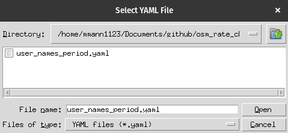

# Open Street Map Rate Check

This module calculates the rate of OSM edits based on the weighted average of changesets submitted the same day. A session is determined as the period between the initial and final changset - with a minimum of 1 hour between changeset within a session.

Edit rates are weighted to account for the fact that short editing sessions rate estimates are likely biased since the initial changese edits are ignored by the algorithm. As such, longer sessions are weighted more heavily than shorter sessions to account for this bias.

## Install

```bash
git clone https://github.com/mmann1123/osm_rate_check.git
cd osm_rate_check
pip install . 
```

## Usage for group statistics

First update `user_names_period.yaml` with the OSM usernames you want to check and the time period you want to check. The time period is the number of days back from the current date you want to check. 

``` yaml
user_names:
  - username: mmann1123
    period: 7
  - username: user2
    period: 7
```

Or if all users will use the same period, you can specify the period at the top of the file. 

``` yaml
default_days: 7
user_names:
  - username: mmann1123
  - username: user2
```

Then run the following command to get the rate of edits for the users in the `user_names_period.yaml` file. 

```bash
python path/to/osm_rate_check/group_osm_rate_check.py
```

Then select the `user_names_period.yaml` file when prompted.



The output will be a csv file with the rate of edits for each user called `OSM_Rate_date_period.csv` and another with inactive users called `OSM_MissingUsers_date_period.csv`.

## Useage for individual statistics

First run the script:

```bash
python path/to/osm_rate_check/osm_rate_check.py
```

Then enter the username you want to check, and the number of days back you want to search. The output will be the rate of edits for that user. 

An example outputs is below:

``` bash
Enter the OSM username: isamah
How many days back do you want to search: 5
Fetching changesets...
Grouping changesets...
Calculating rates...
From 2024-10-02 03:34:41 to 2024-10-02 04:44:16 (1.16 hours):
  Nodes added: 449, Rate: 387.16 nodes/hour
  Ways added: 53, Rate: 45.70 ways/hour
--------------------------------------------------
From 2024-09-30 04:12:28 to 2024-09-30 04:45:23 (0.55 hours):
  Nodes added: 92, Rate: 167.70 nodes/hour
  Ways added: 83, Rate: 151.29 ways/hour
--------------------------------------------------
--------------------------------------------------
Weighted node rate: 316.68 nodes/hour
```

## Citation
Michael Mann. (2024). mmann1123/osm_rate_check: pulling_speed (v1.0.1). Zenodo. https://doi.org/10.5281/zenodo.13887134
